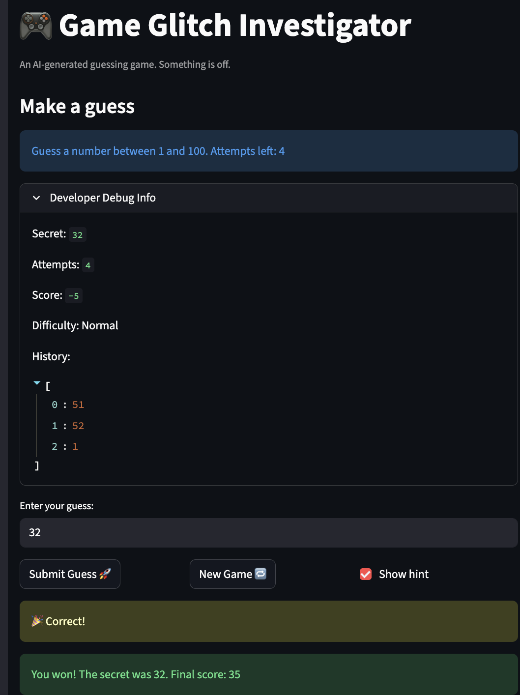

# 🎮 Game Glitch Investigator: The Impossible Guesser

## 🚨 The Situation

You asked an AI to build a simple "Number Guessing Game" using Streamlit.
It wrote the code, ran away, and now the game is unplayable. 

- You can't win.
- The hints lie to you.
- The secret number seems to have commitment issues.

## 🛠️ Setup

1. Install dependencies: `pip install -r requirements.txt`
2. Run the broken app: `python -m streamlit run app.py`

## 🕵️‍♂️ Your Mission

1. **Play the game.** Open the "Developer Debug Info" tab in the app to see the secret number. Try to win.
2. **Find the State Bug.** Why does the secret number change every time you click "Submit"? Ask ChatGPT: *"How do I keep a variable from resetting in Streamlit when I click a button?"*
3. **Fix the Logic.** The hints ("Higher/Lower") are wrong. Fix them.
4. **Refactor & Test.** - Move the logic into `logic_utils.py`.
   - Run `pytest` in your terminal.
   - Keep fixing until all tests pass!

## 📝 Document Your Experience

- [ ] Describe the game's purpose.
The game is a number guessing game called "Glitchy Guesser" where the
player tries to guess a secret number within a limited number of attempts.
The player can choose a difficulty (Easy, Normal, or Hard), which changes
the number range and attempt limit. After each guess, the game gives a
hint telling the player whether to go higher or lower.

- [ ] Detail which bugs you found.
1. The hints were backwards — "Too High" said "Go HIGHER!" and
   "Too Low" said "Go LOWER!", which misled the player.
2. The New Game button did not fully restart the game — it failed
   to reset the score, status, and history.
3. On every even attempt, the secret number was converted to a string,
   which broke the comparison in check_guess and made it impossible to win.
4. The New Game button ignored the selected difficulty and always
   used a hardcoded range of 1–100.

- [ ] Explain what fixes you applied.
1. Swapped the hint messages in check_guess so "Too High" shows
   "Go LOWER!" and "Too Low" shows "Go HIGHER!".
2. Added score, status, and history resets to the New Game button logic.
3. Removed the string conversion of the secret number so check_guess
   always compares two integers.
4. Changed the New Game secret to use random.randint(low, high)
   based on the selected difficulty instead of hardcoded 1–100.

## 📸 Demo

- [ ] [Insert a screenshot of your fixed, winning game here]

## 🚀 Stretch Features

- [ ] [If you choose to complete Challenge 4, insert a screenshot of your Enhanced Game UI here]
